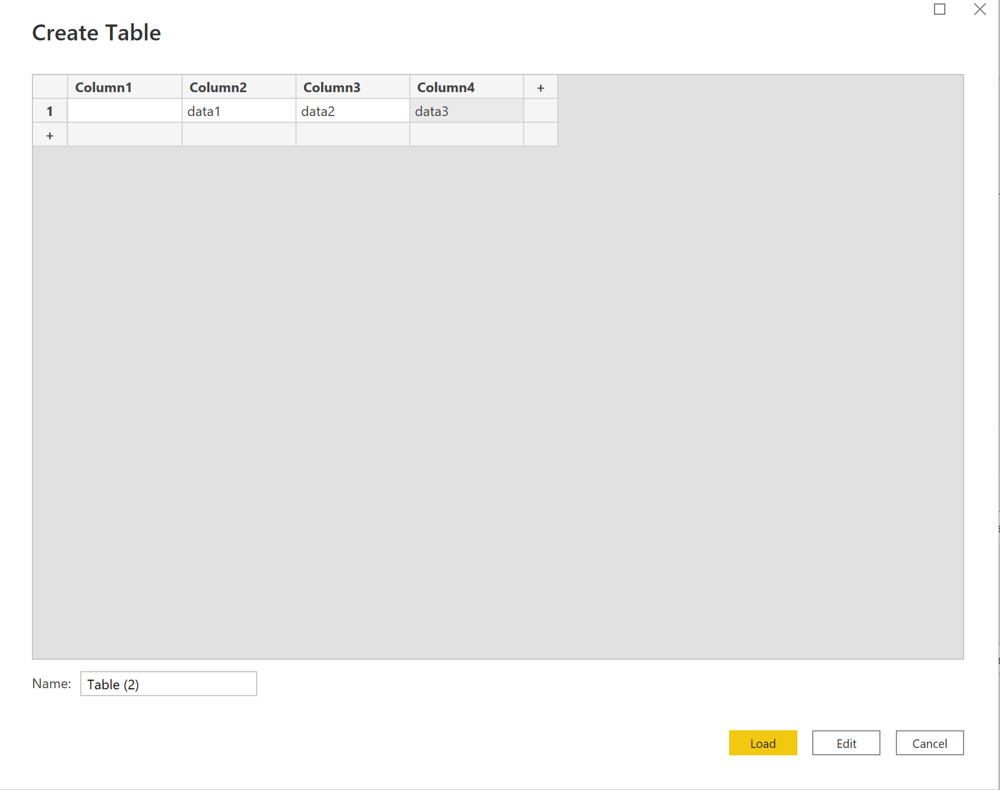
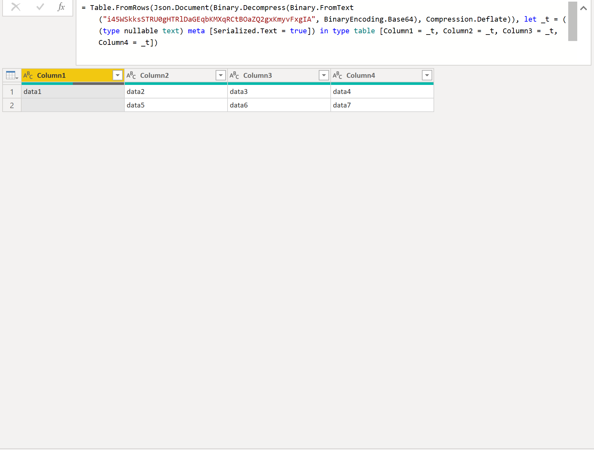

# Power BI Customize Table
The purpose of this tool is to generate a base64 code that power bi needed to generate your customize table.

# Introduction
One of the limitation that I encountered while using Power BI, was could not edit the table if I import the data directly from the Excel file, such as add a new column.
  

I want to achieve a goal which are automatically import the Excel data with my own customize table style. Below are the steps of how I achieved my goal.

Firstly, you need to use [Enter Data] function in Power BI, and a page below will be shown.

Edit the table column heading to whatever you like <strong>BUT</strong> make sure the number of columns <strong>MUST</strong> matched with the data columns that you want to import later.

After you have created a table with the [Enter Data] function, you will see a page like below with clicked on the [Edit Query] of your new table.

From the generated power query, is showing that the table is generating through a base64 encoding text. Therefore, this is why this tool built. Instead of enter the data manually, this tool helps to read your Excel data and generate the base64 code.

Last but not least, before you replace the generated code into your Power BI, <strong>REMEMBER</strong> to remove the <strong>FIRST 2</strong> and <strong>last</strong> character/symbol
